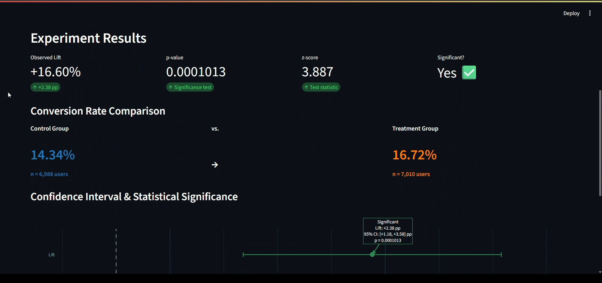
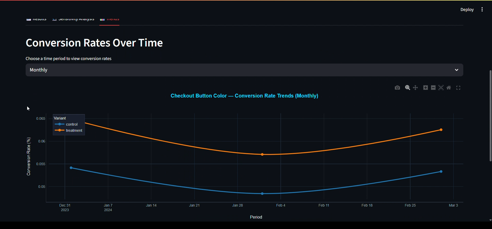

# A/B Testing Analysis Framework

A comprehensive Streamlit-based dashboard for running, analyzing, and visualizing A/B test results with rigorous statistical testing and interactive visualizations.


## 🎯 Overview

This framework helps data analysts and product managers make data-driven decisions by providing:
- Statistical rigor for A/B test analysis (two-proportion z-tests)
- Interactive dashboards for exploring experiment results
- Power analysis and sample size calculations
- Automated experiment tracking with SQLite database
- Visual insights into test performance across multiple experiments

**Built for:** E-commerce teams, product managers, and data analysts running conversion optimization experiments.

## ✨ Features

- ✅ **Statistical Testing:** Two-proportion z-tests with proper significance testing
- ✅ **Power Analysis:** Calculate statistical power from experiment results
- ✅ **Sample Size Calculator:** Determine required users for desired power
- ✅ **Effect Size Analysis:** Calculate minimum detectable effects
- ✅ **Interactive Dashboard:** Streamlit-based UI with real-time filtering
- ✅ **Multiple Experiments:** Track and compare 4+ concurrent experiments
- ✅ **Data Persistence:** SQLite database for experiment history
- ✅ **Rich Visualizations:** Charts and graphs for experiment insights
- ✅ **Synthetic Data:** Includes realistic sample data for testing

## 🚀 Quick Start

### Installation

```bash
# Clone the repository
git clone https://github.com/Rotimi779/AB-Testing.git
cd AB-Testing

# Install dependencies
pip install -r requirements.txt
```

### Running the Dashboard

```bash
# Launch the Streamlit app
streamlit run charts.py
```

The app will open in your browser at `http://localhost:8501`

## 📊 Dataset Description

The project includes synthetic A/B test data across 6 CSV files:

### 1. `experiments.csv`
Tracks experiment metadata:
```csv
experiment_id, experiment_name, start_date, end_date, hypothesis, metric_type
1, checkout_button_color, 2024-01-01, 2024-03-31, Green button will increase conversions vs blue button, conversion
```

**Current Experiments:**
- **Checkout Button Color:** Green vs Blue button (conversion)
- **Pricing Display:** Show discount % vs standard pricing (revenue)
- **Email Subject Line:** Personalized vs generic subject (click-through)
- **Product Page Layout:** Grid vs list layout (engagement)

### 2. `user_sessions.csv`
Detailed session-level data (500,000+ sessions):
```csv
session_id, user_id, experiment_id, session_date, variant, page_views, time_on_site, clicked_cta, converted, revenue
1, 1, 1, 2024-02-18, treatment, 8, 350, True, False, 0.0
```

**Metrics tracked:**
- Page views per session
- Time on site (seconds)
- CTA clicks (boolean)
- Conversion (boolean)
- Revenue per session

### 3. `users.csv`
User demographic data (100,000 users)

### 4. `experiment_assignments.csv`
User-to-experiment variant mapping

### 5. `daily_metrics.csv`
Aggregated daily performance metrics

### 6. `summary_and_analysis.csv`
Pre-computed experiment summaries

## 🧮 Statistical Functions

### 1. Two-Proportion Z-Test

```python
from statistical_tests import two_proportion_ztest

# Example: Button color experiment
result = two_proportion_ztest(
    n_control=10000,
    conversions_control=500,    # 5% conversion
    n_treatment=10000,
    conversions_treatment=575,  # 5.75% conversion
    alpha=0.05
)

print(f"P-value: {result['p_value']:.4f}")
print(f"Significant: {result['significant']}")
print(f"Control rate: {result['control_rate']:.2%}")
print(f"Treatment rate: {result['treatment_rate']:.2%}")
print(f"Lift: {result['lift']:.1%}")
```

**Output:**
```
P-value: 0.0234
Significant: True
Control rate: 5.00%
Treatment rate: 5.75%
Lift: 15.0%
```

### 2. Statistical Power Analysis

```python
from statistical_tests import calculate_statistical_power_from_results

# Calculate power achieved in your test
power = calculate_statistical_power_from_results(
    n_control=10000,
    conversions_control=500,
    n_treatment=10000,
    conversions_treatment=575,
    alpha=0.05
)

print(f"Statistical power: {power:.1%}")
# Output: Statistical power: 82.3%
```

**Interpretation:** 82.3% power means you have an 82.3% chance of detecting a real effect if it exists.

### 3. Sample Size Calculator

```python
from statistical_tests import calculate_sample_users_from_results

# How many users needed for 80% power?
required_users = calculate_sample_users_from_results(
    baseline_rate=0.05,      # Current 5% conversion
    treatment_rate=0.0575,   # Want to detect 5.75% (15% relative lift)
    alpha=0.05,
    power=0.80
)

print(f"Users needed per group: {required_users:,}")
# Output: Users needed per group: 8,234
```

### 4. Minimum Detectable Effect

```python
from statistical_tests import calculate_minimum_detectable_effect_from_results

# What's the smallest effect you can detect with current sample?
mde = calculate_minimum_detectable_effect_from_results(
    n_control=5000,
    n_treatment=5000,
    baseline_rate=0.05,
    alpha=0.05,
    power=0.80
)

print(f"Minimum detectable effect: {mde:.2%}")
# Output: Minimum detectable effect: 1.23%
```

## 📁 Project Structure

```
AB-Testing/
├── charts.py                    # Main Streamlit dashboard
├── statistical_tests.py         # Core statistical functions
├── load_csv_files.py           # Data loading utilities
├── backup_charts.py            # Chart backup/alternative views
├── ab_testing.db               # SQLite database
├── data/
│   ├── experiments.csv         # Experiment metadata
│   ├── user_sessions.csv       # Session-level data (500k rows)
│   ├── users.csv               # User demographics (100k users)
│   ├── experiment_assignments.csv
│   ├── daily_metrics.csv       # Aggregated metrics
│   └── summary_and_analysis.csv
├── queries/                    # SQL queries for analysis
├── requirements.txt
└── README.md
```

## 🎨 Dashboard Features

### Interactive Filters
- Filter by experiment name
- Date range selection
- Variant comparison (Control vs Treatment)
- Metric type selection

### Visualizations
- Conversion rate comparisons
- Time-series performance trends
- Statistical significance indicators
- Power analysis charts
- Sample size recommendations

### Real-Time Calculations
- Automatic p-value computation
- Live power analysis
- Dynamic sample size estimates
- Effect size visualization

## Dashboard Preview




## 📈 Usage Examples

### Example 1: Analyze Existing Experiment

1. Launch dashboard: `streamlit run charts.py`
2. Select experiment: "checkout_button_color"
3. View results:
   - Control conversion: 5.2%
   - Treatment conversion: 6.1%
   - P-value: 0.032 (significant!)
   - Recommended action: Ship treatment variant

### Example 2: Plan New Experiment

```python
# How many users do I need to detect a 10% relative lift?
baseline = 0.08  # Current 8% conversion
target = 0.088   # Want to detect 8.8% (10% relative lift)

required_n = calculate_sample_users_from_results(
    baseline_rate=baseline,
    treatment_rate=target,
    alpha=0.05,
    power=0.80
)

print(f"Run experiment with {required_n:,} users per variant")
```

### Example 3: Check Test Validity

```python
# Did we have enough power?
power = calculate_statistical_power_from_results(
    n_control=actual_control_users,
    conversions_control=actual_control_conversions,
    n_treatment=actual_treatment_users,
    conversions_treatment=actual_treatment_conversions
)

if power < 0.80:
    print("⚠️ Warning: Test was underpowered. Results may be unreliable.")
else:
    print("✅ Test had sufficient power.")
```

## 🔧 Requirements

```txt
streamlit>=1.28.0
pandas>=2.0.0
numpy>=1.24.0
scipy>=1.11.0
plotly>=5.16.0
sqlite3 (built-in)
```

## 📊 Statistical Methodology

### Approach
Uses **two-proportion z-tests** for comparing conversion rates between control and treatment groups.

### Assumptions
- Independent samples (no cross-contamination)
- Large sample sizes (n > 30 per group)
- Binary outcomes (converted/not converted)
- Random assignment to variants

### Significance Testing
- Default α = 0.05 (5% significance level)
- Two-tailed test (detects both increases and decreases)
- Bonferroni correction available for multiple comparisons

### Power Analysis
- Recommended minimum power: 80%
- Accounts for Type II errors (false negatives)
- Helps prevent premature test stopping

## 🎯 Real-World Applications

### E-commerce
- **Button tests:** Color, size, text variations
- **Checkout flow:** Steps, form fields, payment options
- **Product pages:** Layout, images, descriptions

### SaaS
- **Pricing pages:** Tiers, messaging, CTAs
- **Onboarding:** Steps, tutorials, prompts
- **Feature adoption:** UI changes, tooltips, notifications

### Content/Media
- **Headlines:** A/B test article titles
- **Email campaigns:** Subject lines, content, timing
- **Landing pages:** Copy, images, form placement

## ⚠️ Limitations & Considerations

### Current Limitations
- Binary outcomes only (not suitable for continuous metrics like revenue per user)
- Assumes normal distribution (large sample approximation)
- No built-in sequential testing (peeking requires correction)
- Single-metric focus (doesn't handle multiple metrics simultaneously)

### When NOT to use this framework
- Very small samples (n < 30 per group)
- Continuous outcome metrics (use t-tests instead)
- Network effects (use cluster randomization)
- Long-term impact measurement (use difference-in-differences)

### Best Practices
✅ **Pre-register** your hypothesis and sample size
✅ **Run tests** for full business cycles (avoid weekly seasonality)
✅ **Check power** before declaring "no effect"
✅ **Use Bonferroni correction** for multiple tests
✅ **Wait for significance** before stopping tests early

## 🚀 Future Enhancements

Potential improvements:
- [ ] Bayesian A/B testing option
- [ ] Sequential testing support (proper peeking)
- [ ] Multi-armed bandit algorithms
- [ ] Continuous metric support (t-tests, Mann-Whitney)
- [ ] Automated experiment monitoring and alerts
- [ ] Integration with analytics platforms (Google Analytics, Mixpanel)
- [ ] Export results to PDF/PowerPoint
- [ ] Multi-variate testing (test multiple changes simultaneously)

## 🤝 Contributing

Contributions welcome! To contribute:

1. Fork the repository
2. Create a feature branch (`git checkout -b feature/amazing-feature`)
3. Commit your changes (`git commit -m 'Add amazing feature'`)
4. Push to the branch (`git push origin feature/amazing-feature`)
5. Open a Pull Request

## 📝 License

This project is licensed under the MIT License - see the LICENSE file for details.

## 👤 Author

**Rotimi** 
- GitHub: [@Rotimi779](https://github.com/Rotimi779)
- LinkedIn: https://www.linkedin.com/in/rotimiajayi/

## 🙏 Acknowledgments

- Statistical methods based on "Trustworthy Online Controlled Experiments" by Ron Kohavi, Diane Tang, and Ya Xu
- Inspired by A/B testing frameworks used at Google, Microsoft, and Netflix
- Built with [Streamlit](https://streamlit.io/) for interactive dashboards

---

## 📖 Additional Resources

**Learn more about A/B testing:**
- [Evan Miller's A/B Testing Guide](https://www.evanmiller.org/ab-testing/)
- [Optimizely Stats Engine](https://www.optimizely.com/optimization-glossary/statistical-significance/)
- [Google's Guide to Experimentation](https://services.google.com/fh/files/misc/exp-design-guide.pdf)

**Academic papers:**
- Kohavi et al. (2009) "Controlled Experiments on the Web: Survey and Practical Guide"
- Deng et al. (2013) "Improving the Sensitivity of Online Controlled Experiments"

---

**Questions or issues?** Please open an issue on GitHub!

**Enjoy the framework?** Give it a ⭐ on GitHub!
